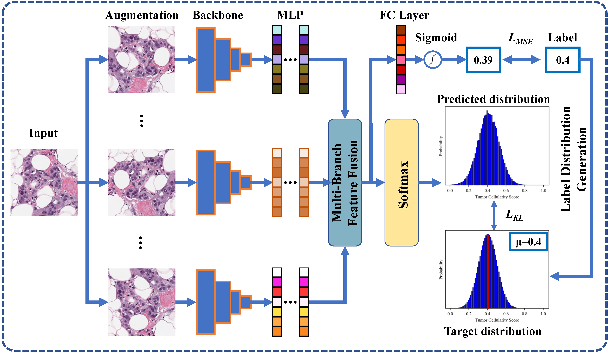

# ULTRA-pytorch


Official Pytorch Code for the paper ["ULTRA：Uncertainty-aware Label Distribution Learning for Breast Tumor Cellularity Assessment"](https://arxiv.org/abs/2206.06623) , presented at MICCAI 2022.


# Introduction

Neoadjuvant therapy (NAT) for breast cancer is a common treatment option in clinical practice. Tumor cellularity (TC), which represents the  percentage of invasive tumors in the tumor bed, has been widely used to  quantify the response of breast cancer to NAT. Therefore, automatic TC  estimation is significant in clinical practice. However, existing  state-of-the-art methods usually take it as a TC score regression  problem, which ignores the ambiguity of TC labels caused by subjective  assessment or multiple raters. In this paper, to efficiently leverage  the label ambiguities, we proposed an Uncertainty-aware Label disTRibution leArning (ULTRA) framework for automatic TC estimation. The proposed ULTRA first converted the single-value TC labels to discrete  label distributions, which effectively models the ambiguity among all 
possible TC labels. Furthermore, the network learned TC label  distributions by minimizing the Kullback-Leibler (KL) divergence between the predicted and ground-truth TC label distributions, which better supervised the model to leverage the ambiguity of TC labels. Moreover, the ULTRA mimicked the multi-rater fusion process in clinical practice  with a multi-branch feature fusion module to further explore the 
uncertainties of TC labels. We evaluated the ULTRA on the public BreastPathQ dataset. The experimental results demonstrate that the ULTRA outperformed the regression-based methods for a large margin and achieved state-of-the-art results. 

<p align="center">
  
</p>

### Prerequisites:

- Python 3.6
- Pytorch 1.8
- Detailed environment Installation:  `pip install -r requirements.txt` 


### Downloading  datasets:

1) SPIE-AAPM-NCI BreastPathQ Dataset - <a href="https://breastpathq.grand-challenge.org/"> Challenge Link  </a>| <a href = "https://wiki.cancerimagingarchive.net/pages/viewpage.action?pageId=52758117#527581177c5a8c0c0cef44e488b824bd7de60428 
"> Whole Slide Imaging (WSI) Link</a>  

# How to Us this Code

### Clone this repository:

```bash
git clone git@github.com:PerceptionComputingLab/ULTRA.git
cd ULTRA
```


### Dataset Preparation

The training, validation and testing folders  contain multiple images.  The training and validation labels are listed in two csv files.

```bash
Data Folder-----
      train----
          99788_1.tif
          99788_2.tif
          .......
      validation----
          99854_1.tif
          99854_2.tif
          .......
      test----
          102174_1.tif
          102174_2.tif
          .......
      train_labels.csv
      val_labels.csv
```

### Training :

（1）Train the backbone network to get the pretrained model.

```bash
python train_backbone.py --data_path "Directory contains training and validation data " 
```

 (2) Retrain the whole network by loading the pretrained model from the first stage.

```bash 
python train_ldl.py --data_path "Directory contains training and validation data " --pre_train_path 'pretrain model path' 
```

### Testing :

```bash 
python test.py --checkpoint_path " enter the checkpoint path" --test_path "test dataset directory" 
```

**<u>*Notice:  Do not change the  location and the name of the checkpoint path since we would automatically parse the name string to get the model configurations!</u>***

### Acknowledgement:

Our code is inspired from <a href="https://github.com/nzl-thu/MUSDL">MUSDL</a>, <a href="https://github.com/srinidhiPY/SSL_CR_Histo">SSL_CR_Histo</a>, <a href="https://github.com/JohnleeHIT/SLEX-Net">SLEXNet</a> 

# Citation:

```bash 
@article{li2022ultra,
  title={ULTRA: Uncertainty-aware Label Distribution Learning for Breast Tumor Cellularity Assessment},
  author={Li, Xiangyu and Liang, Xinjie and Luo, Gongning and Wang, Wei and Wang, Kuanquan and Li, Shuo},
  journal={arXiv preprint arXiv:2206.06623},
  year={2022}
}
```